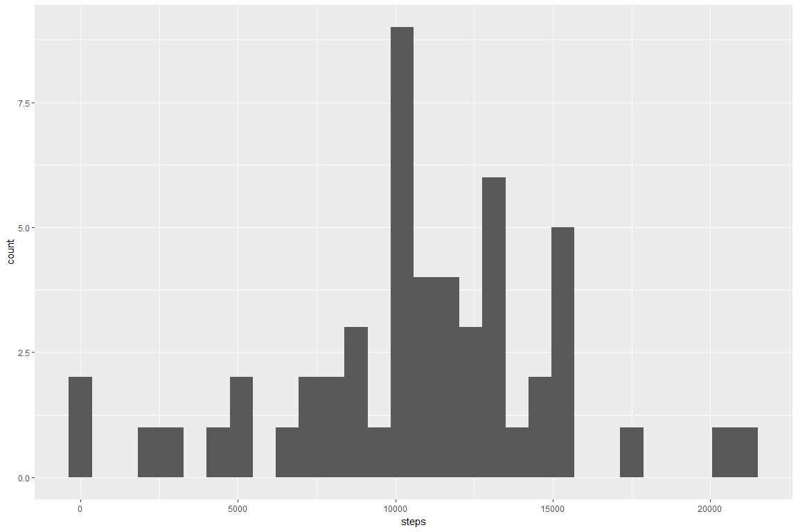
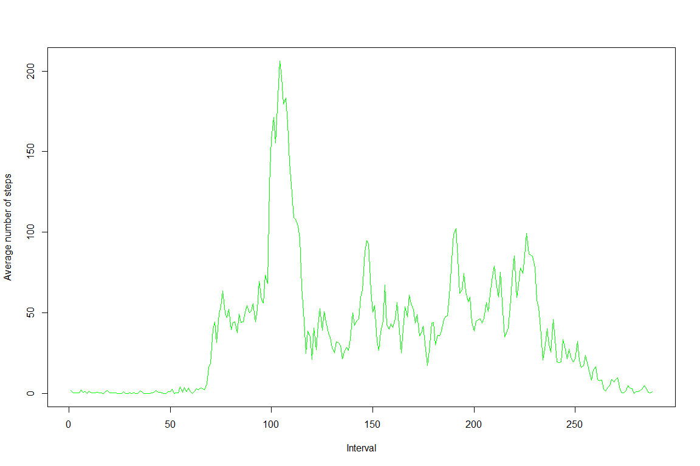
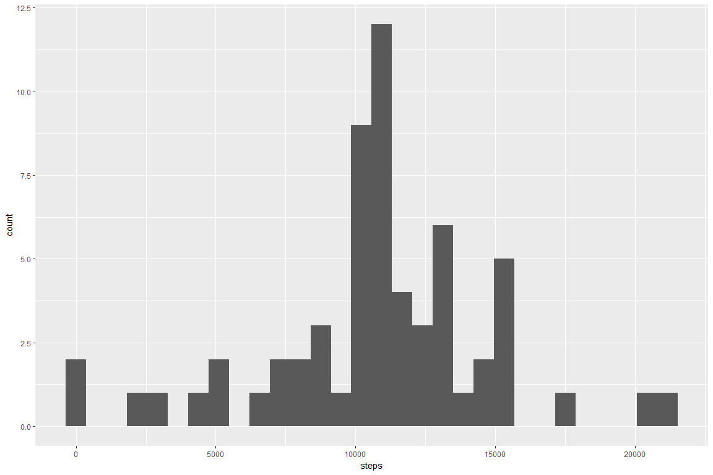
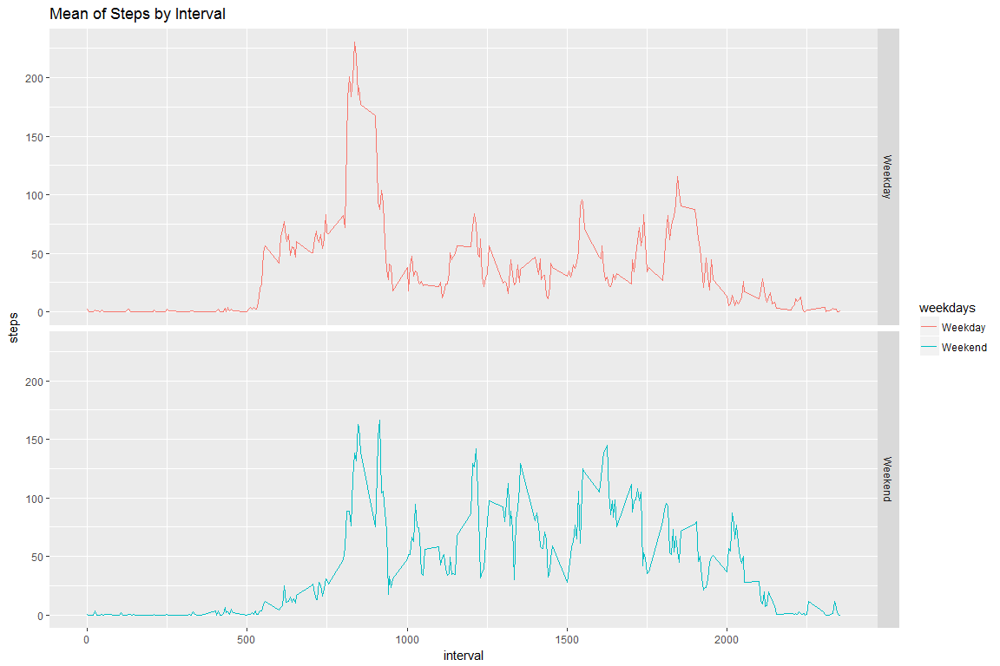

#Week 2 project


##Part 1:Loading and processing the data:


```r
setwd("C:/Users/ahilal/Desktop/Data Science Specialization/Coursera Course 5/Week 2 assignment")
library(ggplot2)
unzip("activity.zip")
dataset <- read.csv("activity.csv")
```
##Part 2: Finding the mean total number of steps taken per day:
###Calculating the total number of steps taken per day:

```r
TotalStepsPerday <- aggregate(steps ~ date, data = dataset,FUN = sum)
```

###Drawing a histogram of the total number of steps taken each day

```r
qplot(steps, data=TotalStepsPerday)
```

<!-- -->

###The mean of the total number of steps taken each day is:

```r
mean(TotalStepsPerday$steps)
```

```
## [1] 10766.19
```

###The median of the total number of steps taken each day is:

```r
median(TotalStepsPerday$steps)
```

```
## [1] 10765
```

### Seperating NA values

```r
NAvalues <- is.na(dataset$steps)
```

##Part 3:Average daily dctivity pattern analysis:
###A time series plot of the 5-minute interval (x-axis) and the average number of steps taken, averaged across all days

```r
Cleandataset <- dataset[!NAvalues,]

Averagesdataset <- aggregate(steps~ interval, Cleandataset,FUN = mean)

plot(Averagesdataset$steps,type="l",col="green",lwd=1.5, xlab = "Interval",ylab = "Average number of steps")
```

<!-- -->

### The 5-minute interval, on average across all the days in the dataset, containing the maximum number of steps:


```r
MaxInterval <- Averagesdataset[which.max(Averagesdataset$steps),]

MaxInterval
```

```
##     interval    steps
## 104      835 206.1698
```

##Part 4: Missing values:
###The total number of missing values is


```r
sum(NAvalues)
```

```
## [1] 2304
```

###Mergin with the original data set matching the average number of steps with the intervals

```r
names(Averagesdataset)[2] <- "mean.steps"

dataset2 <- merge(dataset,Averagesdataset)
```

###replacing the NA values with the average

```r
dataset2$steps[is.na(dataset2$steps)] <- dataset2$mean.steps[is.na(dataset2$steps)]
```

###Calculating the updated total number of steps taken per day:

```r
TotalStepsPerday2 <- aggregate(steps ~ date, data = dataset2,FUN = sum)
```

###Drawing an upated histogram of the total number of steps taken each day

```r
qplot(steps, data=TotalStepsPerday2)
```

<!-- -->

###Finding the updated mean and median:

```r
mean(TotalStepsPerday2$steps)
```

```
## [1] 10766.19
```

```r
median(TotalStepsPerday2$steps)
```

```
## [1] 10766.19
```

###As shown below the mean does not change but the median does

```r
mean(TotalStepsPerday2$steps)-mean(TotalStepsPerday$steps)
```

```
## [1] 0
```

```r
median(TotalStepsPerday2$steps) - median(TotalStepsPerday$steps)
```

```
## [1] 1.188679
```

##Part 5: Weekdays vs weekends:

###finding the day:

```r
dataset2$weekdays <- weekdays(as.Date(dataset2$date))
```

###Splitting between weekend and weekday

```r
dataset2$weekdays <- ifelse(dataset2$weekdays == "Sunday" | dataset2$weekdays == "Saturday", "Weekend","Weekday")
```

###Finding the means and splitting between Weekdays and Weekends

```r
AveragesdatasetWeekdays <- aggregate(steps ~ interval + weekdays,dataset2, FUN = mean)
```

###Plotting the 2 graphs:

```r
ggplot(AveragesdatasetWeekdays, aes(x = interval, y=steps, color=weekdays)) +
  geom_line() +
  facet_grid(weekdays ~ .) +
  labs(title = "Mean of Steps by Interval", x = "interval", y = "steps")
```

<!-- -->
